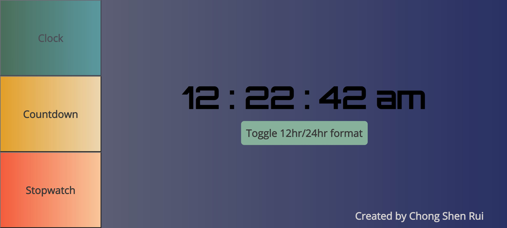

# Clock-Features Website Mini-Project

## Introduction

- First attempt at learning web development.
- Languages used are HTML, CSS and Javascript, no frameworks used.

## Key Learning Points

- Fundamentals of HTML, CSS and Javascript
- Responsive Design using CSS Media Queries
- CSS Cascade and Specificity Rules

## Screenshots

